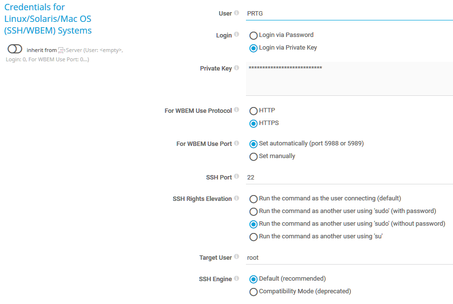

# nas_pkg_versions
Bash script for PRTG by Paessler to monitoring status of available updates of DSM packages.

The sensor will show the availability and the packages and their new versions in the status bar.

Sensor has to be created in PRTG on your Synology device.

Sensor tested on DS 918+ & DS 420+ with DSM 7.0.1-42218 and DS 413 with DSM 6.2.4-25556-2

### Prerequisites

Be sure you have set correct logon values for SSH in your device.

I personally use "Login via private key" with an user especially for monitoring which also may use sudo for this script without a password.



**HINT:** Since DSM 6.2.2 for SSH access the user has to be member of the local Administrators group on your Synology NAS.

### Installing

Place the script to /var/prtg/scriptsxml on your Synology NAS and make it executable. (You may have to create this directory structure because PRTG expects the script here.)

```
wget https://raw.githubusercontent.com/WAdama/nas_pkg_versions/master/nas_pkg_versions.sh
```

On your PRTG system place the ovl file in *INSTALLDIR\PRTG Network Monitor\lookups\custom* and refresh it under **System Administration / Administrative Tools**

In PRTG create under your device which represents your Synology a SSH custom advanced senor.

Parameters are not needed as the script get all information from the original tools offered by DSM.

**HINT:** This sensor works only if the Synology device has a connect to the internet as the original DSM command "synopkg" is used to get the information from the Synology servers.

The sensor will show in text the packages which have an update and the new version.


